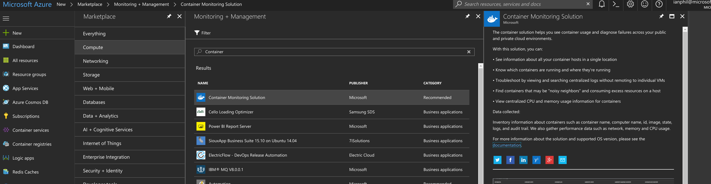

# Monitoring Containers with OMS
In this section, we are going to set up a container to integrate our Docker environment with Azure's Operations Management Suite.

## Task 1: Prepare OMS
1. Add Docker management solution
    1. Open the Azure portal in your browser
    2. In the New blade under Marketplace, select Monitoring + management.
    3. In the Monitoring + management blade, click See all and search for Docker<br>
    
    4. Click on **Containers** then click *Create*
    5. Click on _Select a workspace_ and then click **Create new workspace**
    6. Provide the details for the new workspace, check “Pin to dashboard” and click OK
    7. After the validation click **Create**
    8. 'X' to close the blade, then click **Create**

2. Retrieve the workspace id and primary key
    1. On the Azure portal dashboard click on the Containers solution tile<br>
    
    2. Click on the OMS Portal icon at the top
    3. Click on **Data Sources** connected tile on the home page, then open **Connected Sources**, and then click on **Linux Servers**<br>
    <br>
    <br>
    4. Make note of (_copy somewhere_) the **Workspace ID** and **Primary Key**.  Run the following:
    ```
    export WSID=<your workspace id>
    export KEY=<your key>
    ```

> Phew, that's a lot of set up!  Don't worry, it's worth it!<br>

## Task 2: Run the OMS agent as a Docker container

Run the following command:

```
sudo docker run --privileged -d -v /var/run/docker.sock:/var/run/docker.sock \
-v /var/log:/var/log  -e WSID=$WSID -e KEY=$KEY \
-p 127.0.0.1:25225:25225 -p 127.0.0.1:25224:25224/udp \
--name="omsagent" -h=`hostname` --restart=always microsoft/oms
```
_If this command returns an error, try running `sudo /opt/microsoft/omsagent/bin/omsadmin.sh -X`.  But please only do this in the event of an error._

## Task 3: Monitor
Check OMS Docker view after a few minutes by clicking on the Containers tile on the OMS portal home page.<br>
<br>  _Note this can take some time to initially appear.  You may want go on to another task and then come back to this._


